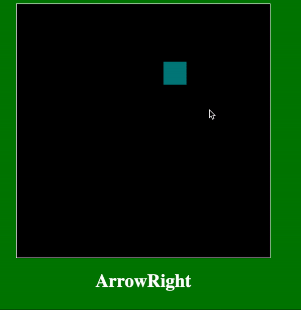

# Box Walker

Bouncing Box, but you control the box, and it doesn't bounce!

**Table of Contents**

- [Overview](#Overview)
  - [Learning Objectives](#learning-objectives)
  - [Project Grading](#project-grading)
- [Lesson Steps](#lesson-steps)
  - [TODO 1: Understand the Template and Change the Box](#todo-1-understand-the-template-and-change-the-box)
  - [TODO 2: Register Keyboard Inputs](#todo-2-register-keyboard-inputs)
  - [TODO 3: React to Specific Keycodes](#todo-3-react-to-specific-keycodes)
  - [TODO 4: Declare `walker` Variable](#todo-4-declare-walker-variable)
  - [TODO 5: Declare Some Helper Functions](#todo-5-declare-some-helper-functions)
  - [TODO 6: Update `speedX` and `speedY` with the Keyboard](#todo-6-update-speedX-and-speedY-with-the-keyboard)
  - [TODO 7: Reset `speedX` and `speedY` on `"keyup"`](#todo-7-reset-speedx-and-speedy-on-keyup)
  - [TODO 8: Implement Borders`](#todo-8-implement-borders)
  - [Challenge Ideas](#challenge-ideas)
  - [Submit Your Work](#submit-your-work)

# Overview



In this project we will be building a simple program that allows us to control the movement of a box with the arrow keys. As a challenge, try limiting the movement of the "walker" to the boundaries of the board. Then, add a second "walker" and turn the program into a game of tag!

## Learning Objectives

- Become familiar with the template repository
- Apply lesson on detecting keyboard inputs
- Make connections to the Bouncing Box program and recognize patterns
- Continue to practice using jQuery

## Push Reminder

To push to GitHub, enter the following commands in bash:

```
git add -A
git commit -m "saving walker"
git push
```

## Project Grading

### Best Practices (25 points)

1. All code in proper sections (setup, core, helpers, etc.) - 5 points
2. Use comments to describe setup and functions - 10 points
3. Use helper functions to separate concerns - 10 points

**NOTE:** Incomplete programs will receive partial credit based on the number of TODOs completed with the above best practices in place.

### Program Progress (75 points)

- TODO 1 - 5 points
- TODO 2 - 10 points
- TODO 3 - 10 points
- TODO 4 - 10 points
- TODO 5 - 10 points
- TODO 6 - 10 points
- TODO 7 - 10 points
- TODO 8 - 10 points
- Challenge 1 - 5 points (bonus)
- Challenge 2 - 5 points (bonus)
- Challenge 3 - 10 points (bonus)
  **NOTE:** the bonus will not give you a score of over 100 should you earn that many points, but these challenges will help you out much later if you can do them.

# Lesson Steps

## **TODO 1: Update the Box ID and Style**

🎯 **Goal:** Rename the box in your HTML to `walker` and customize its appearance with CSS.

---

### Step-by-Step Instructions

1. **Update the HTML ID**

   - Open `index.html`.
   - Find the line that creates the game box:
     ```html
     <div id="gameItem"></div>
     ```
   - Change the `id` from `gameItem` to `walker`.

2. **Update the CSS Styles**
   - Open `style.css`.
   - Either modify the existing `#gameItem` styles, or create a new rule for `#walker`:
     ```css
     #walker {
       width: 50px;
       height: 50px;
       background-color: green;
     }
     ```
   - 🎨 Try customizing the walker’s color, size, or shape to make it unique!

---

<table style="width: 80%; margin-left: auto; margin-right: auto; border-collapse: collapse; margin-top: 15px; background-color: #2c2c2c; border: 1px solid #444; border-radius: 8px; overflow: hidden;">
  <tr>
    <th style="text-align: left; padding: 10px; background-color: #444; color: #e2e2e2; border-bottom: 1px solid #666;">
      💡 Review Important Concepts
    </th>
  </tr>
  <tr>
    <td style="padding: 10px; color: #e2e2e2;">
      <strong>🔗 Matching IDs:</strong> The <code>id</code> you set in HTML must match the CSS selector used to apply styles. For example, an element with <code>id="walker"</code> should be styled using <code>#walker</code> in your CSS.<br><br>
      <strong>🎨 Custom Styling:</strong> CSS allows you to change the walker’s size, color, and shape. Get creative and give your walker a unique appearance!<br><br>
      <strong>💡 jQuery is Coming:</strong> In future steps, you’ll begin using <code>jQuery</code> to select and modify HTML elements using their IDs — just like in CSS. For example:  
      <code>$("#walker")</code> selects the same element that <code>#walker</code> styles in CSS.
    </td>
  </tr>
</table>

---

<br>

### ✅ **Check Your Work!**

- Your walker should now appear on the screen with your custom style.
- If the walker disappears:
  - Check that the ID in your HTML matches the selector in your CSS (`#walker`)
  - Make sure your style changes were saved

<!-- 4 line breaks between TODOs -->

<br><br><br><br>

## **TODO 2: Register Keyboard Inputs**

🎯 **Goal:** Set up an event listener that runs a function whenever a key is pressed on the keyboard.

---

### Step-by-Step Instructions

1. **Find the Setup Code**

   - 🔍 Open `index.js`.
   - Locate the **SETUP** section where jQuery is used to listen for events with this pattern:
     ```js
     $(document).on("...", handleEvent);
     ```

2. **Update the Event Type**

   - Replace the event type with `"keydown"` so that it listens for key presses.

3. **Update the Handler Function Name**

   - Replace `handleEvent` with a new function name: `handleKeyDown`.
   - This is the function that will run when a key is pressed.

4. **Rename the Function**

   - Find the existing `handleEvent` function definition in the **CORE LOGIC** section.
   - Change the function name to `handleKeyDown`.

5. **Log the Key Code**
   - Inside `handleKeyDown`, use `console.log()` to print the numeric key code:
     ```js
     console.log(event.which);
     ```
   - This will help you confirm that key presses are being registered correctly.

---

<table style="width: 80%; margin-left: auto; margin-right: auto; border-collapse: collapse; margin-top: 15px; background-color: #2c2c2c; border: 1px solid #444; border-radius: 8px; overflow: hidden;">
  <tr>
    <th style="text-align: left; padding: 10px; background-color: #444; color: #e2e2e2; border-bottom: 1px solid #666;">
      💡 Review Important Concepts
    </th>
  </tr>
  <tr>
    <td style="padding: 10px; color: #e2e2e2;">
      <strong>🎮 Keyboard Events:</strong> You can detect key presses with jQuery using <code>$(document).on("keydown", callback)</code>.<br><br>
      <strong>🔢 <code>event.which</code>:</strong> This gives you the numeric code of the key that was pressed (e.g. 37 for left arrow, 65 for "A"). You’ll use these codes later to control the walker’s movement.<br><br>
      <strong>🧪 Console Logging:</strong> Always log values you don’t understand! Use <code>console.log(event.which)</code> to confirm your handler is working correctly.
    </td>
  </tr>
</table>

---

<br>

### ✅ **Check Your Work!**

- Preview your game using **Live Server**, then open your browser’s **Console**.
- Press keys and make sure numeric codes (like `37`, `38`, `40`, or `87`) show up in the console.
- If nothing appears:
  - Double-check that your event type is `"keydown"`
  - Make sure the handler function is named `handleKeyDown` and used in both places

<!-- 4 line breaks between TODOs -->

<br><br><br><br>

## **TODO 3: React to Specific Keys**

🎯 **Goal:** Create a `KEY` object to store key codes and use `if` statements to react to arrow key presses.

---

### Step-by-Step Instructions

1. **Create a `KEY` Object**

   - 🔍 In the **SETUP** section of `index.js`, create a constant called `KEY` that maps key names (like `LEFT`, `UP`, `RIGHT`, `DOWN`) to their numeric key codes.
   - We'll give you the code for the **Enter** key, but you'll need to figure out the others on your own:
     ```js
     const KEY = {
       ENTER: 13,
       LEFT: ___,
       UP: ___,
       RIGHT: ___,
       DOWN: ___,
     };
     ```
   - 💡 Use the console from the last TODO or visit [keycode.info](https://keycode.info) to identify the correct values.

2. **Update `handleKeyDown`**

   - Inside the `handleKeyDown` function, write a series of `if` statements that respond to each arrow key.
   - Example:
     ```js
     if (event.which === KEY.LEFT) {
       console.log("left pressed");
     }
     ```
   - Repeat for `KEY.UP`, `KEY.RIGHT`, and `KEY.DOWN`.

3. **Test Your Key Bindings**
   - Open the console and press each arrow key.
   - You should see the appropriate direction printed for each one.

---

<table style="width: 80%; margin-left: auto; margin-right: auto; border-collapse: collapse; margin-top: 15px; background-color: #2c2c2c; border: 1px solid #444; border-radius: 8px; overflow: hidden;">
  <tr>
    <th style="text-align: left; padding: 10px; background-color: #444; color: #e2e2e2; border-bottom: 1px solid #666;">
      💡 Review Important Concepts
    </th>
  </tr>
  <tr>
    <td style="padding: 10px; color: #e2e2e2;">
      <strong>🧪 Use Your Console:</strong> Add a <code>console.log(event.which)</code> inside your <code>handleKeyDown</code> function and press keys to discover their codes.<br><br>
      <strong>🔗 Need Help?</strong> Visit <a href="https://keycode.info" target="_blank">keycode.info</a> and press keys on your keyboard to see their numeric codes.<br><br>
      <strong>✅ Clean Code Tip:</strong> Using a <code>KEY</code> object with named properties makes your logic easier to understand and avoids “magic numbers.”
    </td>
  </tr>
</table>

---

<br>

### ✅ **Check Your Work!**

- Use Live Server and open the **Console**.
- Press each arrow key. You should see:
  - `"left pressed"` for ←
  - `"up pressed"` for ↑
  - `"right pressed"` for →
  - `"down pressed"` for ↓
- If not:
  - Check your `KEY` values and spelling
  - Confirm your `if` statements are using `event.which`

<!-- 4 line breaks between TODOs -->

<br><br><br><br>

## **TODO 4: Declare `walker` Variable**

🎯 **Goal:** Create an object to store the walker's position and speed on the screen.

---

### Step-by-Step Instructions

1. **Create a Global `walker` Variable**

   - 🔍 Scroll to the **SETUP** section in `index.js`.
   - Declare a variable named `walker`.

2. **Assign an Object to `walker`**

   - The `walker` variable should store an object.
   - This object will represent the current state of your game character and should include the following properties:
     - `x` — horizontal position (left/right)
     - `y` — vertical position (up/down)
     - `speedX` — horizontal speed
     - `speedY` — vertical speed

3. **Initialize All Values to `0`**
   - Each property in the object should start with a value of `0`.
   - ✅ If you’re not sure about syntax, think back to how objects were created in the data shapes project.

---

<table style="width: 80%; margin-left: auto; margin-right: auto; border-collapse: collapse; margin-top: 15px; background-color: #2c2c2c; border: 1px solid #444; border-radius: 8px; overflow: hidden;">
  <tr>
    <th style="text-align: left; padding: 10px; background-color: #444; color: #e2e2e2; border-bottom: 1px solid #666;">
      💡 Review Important Concepts
    </th>
  </tr>
  <tr>
    <td style="padding: 10px; color: #e2e2e2;">
      <strong>🧱 Game State Objects:</strong> In JavaScript, objects are used to group related data together. Here, the <code>walker</code> object stores position and movement information.<br><br>
      <strong>📍 <code>x</code> and <code>y</code>:</strong> These represent the walker’s current location in pixels from the top-left corner of the screen.<br><br>
      <strong>💨 <code>speedX</code> and <code>speedY</code>:</strong> These represent how much to change the walker’s position on each update. They will eventually be adjusted by keyboard input.
    </td>
  </tr>
</table>

---

<br>

### ✅ **Check Your Work!**

- Make sure you’ve declared a global variable called `walker` and assigned it an object with **four properties**: `x`, `y`, `speedX`, and `speedY`.
- Each of these should start with a value of `0`.
- Your program won’t crash yet if this is missing — but future steps **depend** on this structure being present and correct.

<!-- 4 line breaks between TODOs -->

<br><br><br><br>

## **TODO 5: Update the Walker's Position in Code**

🎯 **Goal:** Write a helper function that updates the walker’s location based on its current speed.

---

### 🔍 Preview: Updating Object Properties

<table style="width: 80%; margin-left: auto; margin-right: auto; border-collapse: collapse; margin-top: 15px; background-color: #2c2c2c; border: 1px solid #444; border-radius: 8px; overflow: hidden;">
  <tr>
    <th style="text-align: left; padding: 10px; background-color: #444; color: #e2e2e2; border-bottom: 1px solid #666;">
      💭 Updating Object Values
    </th>
  </tr>
  <tr>
    <td style="padding: 10px; color: #e2e2e2;">
      In the <strong>Bouncing Box</strong> project, you moved the box like this:<br><br>
      <code>positionX = positionX + speed;</code><br><br>
      That worked because each value was stored in its own variable.<br><br>
      In this project, we’re storing all of that data in a single object called <code>walker</code>.<br><br>
      So instead of <code>positionX</code>, we now update <code>walker.x</code>.<br>
      And instead of <code>speed</code>, we use <code>walker.speedX</code>.<br><br>
      🧠 It’s the same pattern — we’re just working inside an object.
    </td>
  </tr>
</table>

---

### Step-by-Step Instructions

1. **Define the Function**

   - 🔍 Scroll to the **HELPER FUNCTIONS** section in `index.js`.
   - Create a function called `repositionGameItem()`.

2. **Update the Walker’s `x` and `y` Properties**

   - Inside your function, add the horizontal speed to the x-position.
   - Then add the vertical speed to the y-position.
   - Be sure to use **dot notation** to update both values within the `walker` object.

3. **Call the Function from `newFrame`**
   - Inside the `newFrame` function, call `repositionGameItem()` so that the position updates continuously as the game runs.

---

<table style="width: 80%; margin-left: auto; margin-right: auto; border-collapse: collapse; margin-top: 15px; background-color: #2c2c2c; border: 1px solid #444; border-radius: 8px; overflow: hidden;">
  <tr>
    <th style="text-align: left; padding: 10px; background-color: #444; color: #e2e2e2; border-bottom: 1px solid #666;">
      💡 Review Important Concepts
    </th>
  </tr>
  <tr>
    <td style="padding: 10px; color: #e2e2e2;">
      <strong>🧱 Object Access:</strong> To update a value inside an object, use dot notation — for example, change a property like <code>walker.x</code> based on its current value and speed.<br><br>
      <strong>📦 Stored State:</strong> The object <code>walker</code> stores the character’s position and speed. You’re not moving anything on screen yet — just updating the stored data.<br><br>
      <strong>🔄 Real-Time Updates:</strong> Since <code>newFrame()</code> runs many times per second, calling this function there means your walker’s position will change continuously over time.
    </td>
  </tr>
</table>

---

<br>

### ✅ **Check Your Work!**

- You should now have:
  - A new function called `repositionGameItem()`
  - A call to that function inside `newFrame()`
- Try temporarily assigning a number to `walker.speedX` or `walker.speedY` and use:
  ```js
  console.log(walker.x, walker.y);
  ```
  to check if the values are changing correctly each frame.

<!-- 4 line breaks between TODOs -->

<br><br><br><br>

## TODO 5: Declare Some Helper Functions

**READ:**
Now that we have our data tracking in place, we need to use that data to actually move the `walker` game item on each `update`. This is a problem solved in Bouncing Box.

> > **REMINDER:** The below code snippets are taken directly from _Bouncing Box_ and are not the exact code that you should use here. They are merely _examples_ of how to solve a similar but simpler problem.
>
> To reposition the box in Bouncing Box we wrote:
>
> ```js
> positionX += speedX; // update the position of the box along the x-axis
> ```
>
> And to redraw the box in the new x-location we wrote:
>
> ```js
> $("#box").css("left", positionX); // draw the box in the new location, positionX pixels away from the "left"
> ```

**CODE:**

- **5a)** In the HELPER FUNCTIONS section, declare two new functions called `repositionGameItem()` and `redrawGameItem()`.
- **5b)** Reference the code above to complete these two functions such that they can reposition and redraw the GameItem to move along the x-axis AND the y-axis.
- **5c)** Call each function on each `newFrame`.

**HINT 1:** Use the `"top"` CSS property to draw the box `y` pixels from the `"top"`

**HINT 2:** Check what the id of the GameItem is for your jQuery statements.

**HINT 3:** Keep in mind that you have an object storing your data this time. There are no "positionX", "speedX", ect. variables, so you will need to use the properties of your object.

<br>
<h3 align="center">YOU DO NOT NEED TO OPEN LIVE SERVER FOR THIS TODO</h3>
<br>

## TODO 6: Update `speedX` and `speedY` with the Keyboard

**READ:**
The box isn't moving yet because we initialized the `speedX` and `speedY` properties to `0`. As long as `speedX` is `0`, the `walker` game item will not move along the x-axis. The same goes for `speedY` and the y-axis.

When we press a key, we want the `walker` game item to move in that direction which we can accomplish by, for example, setting the `speedX` propery to some positive number when the right arrow is pressed and setting to a negative value when the left arrow is pressed. Then, on the following `newFrame`, the position of the `walker` game item will be recalculated based on the the code we wrote in TODO 4.

**CODE:**

- **6a)** Modify your `handleKeyDown` function such that when the `KEY.LEFT` key is pressed, the `speedX` property is set to `-5`:

```js
if (event.which === KEY.LEFT) {
  walker.speedX = -5;
}
```

- **6b)** Do the same for the other 3 arrow keys.

> **Question: Why does the box only move diagonally after your press the keys? Take a moment to think about it if you aren't sure. Understanding this can really help you with understanding game mechanics in general**

<hr>

<br>
<br>
<br>
<br>

  <h3 align="center"><b>CHECK YOUR LIVE SERVER AND TEST EACH DIRECTION. REFRESH THE PAGE BETWEEN EACH TEST TO STOP THE DIAGONAL MOVEMENT</b></h3>
  <p align="center"><b>Do you see the walker moving in the appropriate direction? Again, diagonal movment will occur if you don't refresh the page after pressing a key</b></p>
  <p align="center"><b>DO NOT MOVE FORWARD UNLESS YOU SEE THE WALKER MOVING IN THE DIRECTION OF THE ARROW KEYS</b></p>

<br>
<br>
<br>
<br>

## TODO 7: Reset `speedX` and `speedY` on `"keyup"`

**READ:**

We now have motion! However, the `walker` game item doesn't stop moving once we set it off. We need some way to stop it from moving.

Ideally, the `walker` game item would stop moving once we release the arrow key. This `"keyup"` event can be listened for in the same way that the `"keydown"` event can be listened for.

**CODE:**

- **7a)** Similar to the code that you've already written in TODO 5, set up your program to listen for `"keyup"` events and set the `speedX` and `speedY` properties to `0` whenever the arrow keys are released. This will involve both creating the `handleKeyUp` event handler function and registering it.

<hr>

<br>
<br>
<br>
<br>

  <h3 align="center"><b>CHECK YOUR LIVE SERVER AND TEST EACH DIRECTION</b></h3>
  <p align="center"><b>Do you see the walker stopping when you release the arrow keys?</b></p>
  <p align="center"><b>DO NOT MOVE FORWARD UNLESS YOU SEE THE WALKER STOPPING WHEN YOU RELEASE THE ARROW KEYS</b></p>

<br>
<br>
<br>
<br>

## TODO 8: Implement Borders

Your final task is to make sure that the walker object does not leave the board area.

**CODE:**

- **8a)** Make a helper function called `wallCollision()`. In this function, use conditionals to prevent the walker object from leaving the board. You may use `$("#board").width()` and `$("#board").height()` to get the x coordinate of the right wall and the y coordinate of the bottom wall, respctively. You may hardcode the coordinates of the left and top walls as `0`.

**HINT:** Do not reverse the speed if there is a collision, as this will make your object bounce. Instead, simply subtract the speed from its current position.

- **8b)** Call your `wallCollision()` function from your `newFrame()` function. You will want to call it after `repositionGameItem()` but before `redrawGameItem()`.

<hr>

<br>
<br>
<br>
<br>

  <h3 align="center"><b>CHECK YOUR LIVE SERVER AND TEST EACH DIRECTION</b></h3>
  <p align="center"><b>Do you see the walker stopping when it reaches the edge of the board?</b></p>
  <p align="center"><b>DO NOT MOVE FORWARD UNLESS YOU SEE THE WALKER STOPPING WHEN IT REACHES THE EDGE OF THE BOARD</b></p>

<br>
<br>
<br>
<br>

# Challenge Ideas:

Do these if you have time. They are not required, but it will help you out if you know how to do them.

## Add a second player that can be controlled with WASD

What will you need to add to the setup area? What will you need to add to the core logic? What new helper functions will you need?

## Make the player(s) change color when clicked on

If you want the colors to be random, you can produce a random color with the following code:

```js
var randomColor = "#000000".replace(/0/g, function () {
  return (~~(Math.random() * 16)).toString(16);
});
```

There are other, less cryptic ways to produce random numbers, but if you just want a random color, this will work. However, you may use other methods of changing colors as well.

## Detect when the two players collide to make a "tag" game.

After the two players collide, make the player who is "it" turn red and move each player to the opposite corners of the screen. Try making the "it" player have a slightly slower speed so that the other player can escape more easily (and maybe make the board bigger).

# Submit Your Work

Submit your work regularly. Because these files are already being tracked by your GitHub repo, you can skip the "git add" step. Instead, enter the following commands:

> git commit -a -m "saving walker"
>
> git push

Congratulations on completing Walker!
